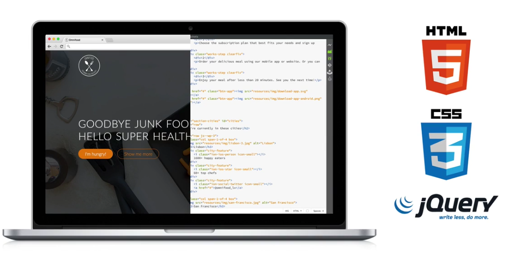

# Before you start the course

## What Will I Learn?
* Real-world skills to build real-world websites: professional, beautiful and truly responsive websites

* A huge project that will teach you everything you need to know to get started with HTML5 and CSS3

* The proven 7 real-world steps from complete scratch to a fully functional and optimized website

* Simple-to-use web design guidelines and tips to make your website stand out from the crowd

* Learn super cool jQuery effects like animations, scroll effects and "sticky" navigation

* Downloadable lectures, code and design assets for the entire project

## Requirements
* No coding or design experience necessary

* Any computer will do — Windows, OSX or Linux

* You don’t need to buy any software — we will use the best free web development editor in the world

## So here is exactly what we cover in this training:

*  Easy-to-follow and hands-on web development with HTML5, CSS3 and some jQuery.

*  The proven 7 real-world steps from complete scratch to a fully functional and optimized website.

*  Simple-to-use web design guidelines and tips to make your website stand out from the crowd.

*  How to get and use images, fonts and icons to make your website shine — all for free.

*  Responsive web design: learn how to create websites that work beautifully on all screen sizes.

*  How to use jQuery for super cool effects like animations, scroll effects and "sticky" navigation.

*  How to optimize your website for good speed performance and for search engines (SEO).

*  How to launch your website for the world to see it.

## Let's now find out if this course is for you. It's a perfect fit if...

### Student #1:
 You are a complete beginner with no idea on how to build a website.

### Student #2: 
You already know some HTML and CSS from some tutorials or videos, but struggle to put together a good-looking, complete website.

### Student #3:
You are a designer and want to expand your skills into HTML5 and CSS3, because all your designer colleagues are learning how to code (they are smart).

Basically, if you are a master of HTML5 and CSS3, if you build the most beautiful websites in the world, then DON'T take the course. Everyone else: you should take the course, today.

## Curriculum For This Course

- Course introduction
- Dive into HTML
- Formatting with CSS
- Web design basics
- Github and Team working 
- The website project
- Responsive web design with media queries
- Let's add some cool effects
- Optimizing and launching our website
- Freelancer 

## Outputs

- Be able to build any static website and we will [bulid this site ](https://bnazmi.github.io/omnifood/)

- How to get a job on [mostqal](https://mostaql.com/u/BnAzmi) as a front end web devloper

- Build your [protopfolio](https://bnazmi.github.io/)

### For Everyone:

- Install [Visual Studio Code](https://code.visualstudio.com/Download) - download the file or click "Build from source"
- Install [Chrome](https://www.google.com/chrome/)

### [VsCode plugins](https://marketplace.visualstudio.com/)
-  HTML Snippets
-  CSS Formatter
-  Live Server
